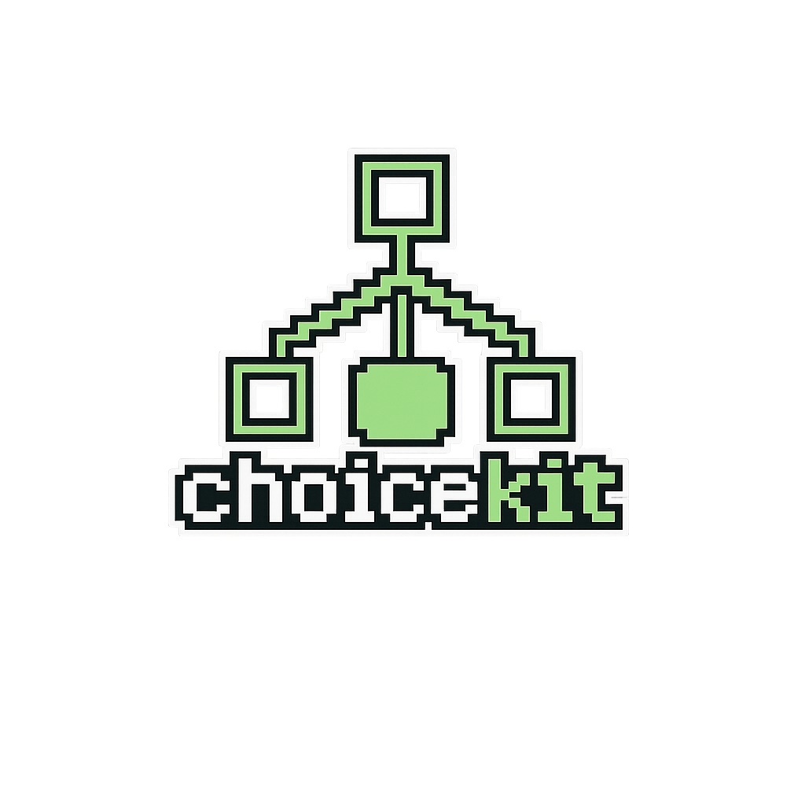

<p align="center">
  
</p>

# choicekit

choicekit is an early-stage Python package for choice modeling.

## Public interface

The top-level `choicekit` package only exports stable public names listed in
`choicekit.__all__`. Keep implementation helpers and experimental modules out
of `src/choicekit/__init__.py` until they are intended to be part of the public
interface.

## Development

Install the package with development tools:

```bash
uv sync --locked --extra dev
```

Run the local checks:

```bash
uv run ruff check .
uv run pytest
uv build
```

## Dependency policy

This project commits `uv.lock` so development and CI use the same resolved
dependency set. When dependencies change, update `pyproject.toml` through
`uv add` or by editing it directly, then run:

```bash
uv lock
```

Commit both `pyproject.toml` and `uv.lock`.
